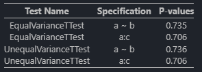

# AlgebraOfInference.jl

[](https://github.com/yl4070/AlgebraOfInference/actions/workflows/CI.yml)

> In early developments! 


Provide unified algebra like syntax for hypthosis testing, inspired by `AlgebraOfGraphics.jl` and R package `infer`. 

The goal of the package is to provide a new interface to `HypothersisTest.jl` and also a wrapper of testings from R via `RCall.jl`. 


## Features

+ `@formula` expression support
+ composable testing constructions


## Quick Starts

Any data source that supports `Tables.jl` interface will work.

To run a test, first specify variable to be used in testing, and multiple specifications can be added together. 

```julia
specs = specify(@formula(a ~ b)) + specify(:a, :c)
```

The same is hypothesis tests, theorectically, it should work with all tests from `HypothesisTests.jl`. Incorporate more tests. 

```julia
tests = testwith(EqualVarianceTTest) + testwith(UnequalVarianceTTest)
```

Then, p-value can be calculated together:
```julia
tbl = (a = rand(100), b = repeat(1:2, inner = 50), c = rand(100))
test_specs = specs * tests
test_specs(tbl) .|> pvalue
```

### Table outputs

Powered by `SummaryTables.jl`, the test outputs can be easily collected into one table:

```julia
test_specs(tbl) |> table
```




## To-Dos

- [x] Nicer printing
- [x] Nice looking tabel outputs
- [ ] Optimize code
- [ ] Import test from R 
- [ ] Refine interface
- [ ] Documentations
- [ ] More series testing


